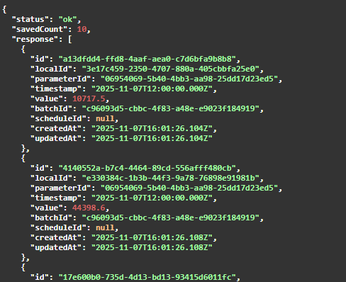

# Projeto Meteo-API

Este Projeto visa pegar as API do Meteomatics (https://www.meteomatics.com/en/weather-api/), e criar uma persistência própria, para poder ser posteriormente usada como Api.

Îndice:

1- Estrutura

2- Tecnologias e Escolhas

3- Instalando Localmente


## 1- Estrutura

### Banco

O Banco de dados envolve algumas tabelas principais:

**Local**: Localidades, com id, nome, latitude e longitude.

**Parameters**: Diferentes parametros de medidas, como temperatura, visibilidade, precipitação, aptos para serem usados e checados.

**Measurement**: A tabela que é o carro chefe! Ela é uma persistência que relembra todos os resultados anteriores.

**Schedule**: Tabela que faz mediçoes agendadas, em dias da semana especificos ou em dias do mês, especificos.

**Alertas**: Lembretes para quando uma localidade apresentar alguma medida de algum parametro maior ou menor que um certo valor. Para gerar assim alertas.

Além de outras tabelas secundárias.

### Api

Semelhante as tabelas temos:

**Local**: Para adicionar registros, ou ver localidades registradas.

**Parameters**: Para adicionar novos parametros nas buscas, ou verificar os já existentes.

**Measurement**: A API mais importante. Ela pode tanto pesquisar e criar novos registros no banco de dados. Quanto mostrar todos que já aconteceram.

**Schedule**: Adicionar uma agenda ou ver as agendas.

**Alertas**: Adicionar um alerta ou ver os alertas.

#### Testes:

Nas rota principal de Measurement, você pode testar, usando o conteúdo do arquivo:
/workspaces/meteoAPI/src/tools/dev/resources/measurement.test.json

Irá dar uma resposta semelhante a esta:



Além disto, passo a passo para Testar os Alertas:

1- Faça uma medição aleatória.
2- Copie o localId, paramterId, value
3- Crie um alerta, usando este parameterId, localId, e com um valor próximo do Value (mas não igual), se for menor, use a condição '>', se for maior, use a confição'<'
4- Por fim, pegue novamente estes valores de localId, parameterId e usando a mesma data utilizada, jogue na primeira rota de medição.
5- Irá dar um resultado que vai incluir uma resposta de "trigger alert"

## 2- Tecnologias e Escolhas

Neste projeto, optei por usar NestJS, Docker, MySQL, e TypeScript como as principais ferramentas. Outras ferramentas envolveram Jest, UUIDv7, entre outros.

Eu escolhi fazer mais de uma tabela, para criar relações entre elas, e interações.

## 3- Instalação

Para instalar e rodar a aplicação localmente, siga os passos abaixo:

1. **Clone o repositório**
```bash
git clone <URL_DO_REPOSITORIO>
cd meteo-api
```

2. **Instale as dependências**

```bash
npm install
```

Obs: Certifique-se de estar usando Node.js >= 20 e npm >= 10, conforme definido no package.json.

3. **Configure as variáveis de ambiente**

No arquivo, .env.example, apague o ".example" ou crie uma versão só com ".env", depois preencha os dados com os seus dados.

OBS: Para a parte do METEOMATICS, vai precisar criar seu user aqui: https://www.meteomatics.com/en/weather-api/
Eles irão te passar login e senha por email.

4. **Gere o Prisma**

```bash
npx prisma generate
```

5. **Rodar a aplicação**

```bash
npm run start:dev
```

6. **Seeds (Opcional)**

Se quiser ir nas seeds, vai no AppModule, e import o DevModule", e coloque entre os módulos.
Depois disto, vai abrir em baixo do seu Swagger uma rota "/dev/seeds", pode usar ela.
Recomendo que depois remova o DevModule do AppModule.

7. **Acessando**

Depois de tudo isto, basta rodar na rota "/". O Swagger já esta configurado na rota principal.
