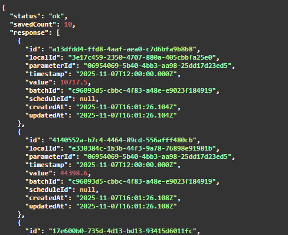

# Meteo-API

API para coleta, armazenamento e monitoramento de dados meteorológicos utilizando a Weather API da Meteomatics.

O projeto foi desenvolvido com foco em cenários de **monitoramento contínuo**, permitindo não apenas consultar dados climáticos, mas também:

- Persistir histórico de medições
- Automatizar coletas periódicas
- Definir alertas baseados em condições específicas

---

## 🚀 Tecnologias

- **Node.js + NestJS** → estrutura modular e escalável
- **TypeScript** → tipagem e maior segurança
- **MySQL + Prisma ORM** → persistência e modelagem relacional
- **Docker** → padronização de ambiente
- **Swagger** → documentação da API
- **Jest** → testes automatizados


## 📦 Modelo de Dados

O sistema foi estruturado de forma relacional, separando entidades de domínio para permitir flexibilidade na coleta e análise dos dados.

- **Location**: Representa um ponto geográfico (latitude/longitude) a ser monitorado.

- **Parameter**: Define quais variáveis climáticas podem ser coletadas (ex: temperatura, umidade, precipitação).

- **Measurement**: Armazena os dados coletados ao longo do tempo, formando o histórico de medições.

- **Schedule**: Responsável por definir a periodicidade das coletas (ex: diariamente, dias específicos da semana ou mês).

- **Alert**: Regras configuráveis que avaliam medições e disparam eventos quando condições são atendidas.

## 🌐 API

A API segue padrão REST e expõe endpoints para gerenciamento das principais entidades:

- **Locations** → criação e consulta de pontos geográficos  
- **Parameters** → gerenciamento das variáveis monitoradas  
- **Measurements** → coleta e consulta de dados climáticos  
- **Schedules** → configuração de coletas automáticas  
- **Alerts** → definição e consulta de regras de alerta  

## 🧪 Testes

Um exemplo de requisição para o endpoint de **Measurement** pode ser encontrado em:

```
src/tools/dev/resources/measurement.test.json
```

A resposta esperada é semelhante a:



### Testando Alertas

1. Crie uma medição
2. Anote: `locationId`, `parameterId` e `value`
3. Crie um alerta com base nesses valores:
   - Use `>` para valores abaixo do esperado
   - Use `<` para valores acima
4. Execute novamente a medição com os mesmos parâmetros

Se a condição for atendida, o sistema retornará um **trigger de alerta**.

## ⚙️ Instalação

### Pré-requisitos

- Docker
- Docker Compose

### Passos

```bash
git clone <URL>
cd meteo-api
cp .env.example .env
docker compose up -d --build
```

### Rodando migrations

```
docker exec -it meteoapi-api-1 sh
npx prisma migrate deploy
```

A aplicação estará disponível em:

```
http://localhost:3000
```


## 🔄 Fluxo de funcionamento 

1. Usuário define um local (latitude/longitude)
2. Um agendamento é criado
3. O sistema consulta a API da Meteomatics periodicamente
4. Os dados são persistidos no banco
5. Regras de alerta são avaliadas
6. Caso condições sejam atendidas, um alerta é disparado


## 🧠 Arquitetura 

A aplicação segue uma estrutura baseada em módulos do NestJS:

- Controllers → entrada das requisições
- Services → regras de negócio
- Repositories/ORM → acesso ao banco
- Scheduler → execução de tarefas periódicas


## Links

Meteomatics: https://www.meteomatics.com/en/weather-api/
